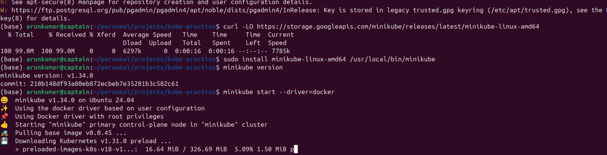

##Docker Hub Push

1.docker login -u username
(ex:docker login -u captaindexter)

2.docker tag image_name captaindexter/kube-practice:latest
(ex:docker tag kube-practice:latest captaindexter/kube-practice:latest)

3.docker push <your-docker-hub-username>/kube-practice:latest
(ex:docker push captaindexter/kube-practice:latest)

##minikube installation

curl -LO https://storage.googleapis.com/minikube/releases/latest/minikube-linux-amd64

sudo install minikube-linux-amd64 /usr/local/bin/minikube

minikube version

minikube start --driver=docker

minikube status

minikube dashboard

minikube stop

minikube delete

##kube control

sudo snap install kubectl --classic

##kube cmds

kubectl get pods

kubectl get deployments

kubectl get svc

kubectl get node

kubectl get all

1.kubectl apply -f deployment.yml (need to create deployment before service)
2.kubectl apply -f deployment-service.yml (create service)

minikube service nodeapp-service

##For logs
kubectl logs pod_name

(ex:kubectl logs nodeapp-deployment-d85fddb96-xl477 or kubectl logs nodeapp-deployment-d85fddb96-xl477 -f)
